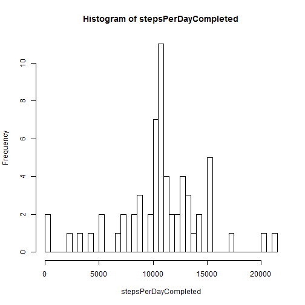

# Reproducible Research: Peer Assessment 1

## Loading and preprocessing the data

Read the data directly from the zip-compressed file.


```r
data <- read.csv(unzip('activity.zip'))
```

Process dates into a more suitable format.


```r
data$date <- as.Date(data$date, format = "%Y-%m-%d")
```


## What is mean total number of steps taken per day?
1. Histogram of the total number of steps taken each day.

  The following code breaks the data using the date information and sums all the steps for the same day:

    
    ```r
    stepsPerDay <- with(data, aggregate(steps, 
                                    by = list(data$date), 
                                    FUN = sum, na.rm = TRUE))
    days <- stepsPerDay$Group.1
    stepsPerDay <- stepsPerDay$x
    hist(stepsPerDay, breaks = length(days))
    ```
    
     

2. Calculate the *mean* and *median* total number of steps taken per day.
        
    
    ```r
    mean(stepsPerDay)
    ```
    
    [1] 9354
    
    ```r
    median(stepsPerDay)
    ```
    
    [1] 10395

## What is the average daily activity pattern?

1. Time series plot of the 5-minute interval (x-axis) and the average number of steps taken, averaged across all days (y-axis).

    
    ```r
    meanStepsPerInterval <- aggregate(data$steps, 
                                            by = list(data$interval), 
                                            FUN = mean, na.rm=TRUE)
    intervalID  <- meanStepsPerInterval$Group.1
    meanStepsPerInterval <- meanStepsPerInterval$x
    plot(intervalID, meanStepsPerInterval, type="l")
    ```
    
     

2. Which 5-minute interval, on average across all the days in the data set, contains the maximum number of steps?
        
    
    ```r
    intervalID[which(meanStepsPerInterval == max(meanStepsPerInterval))]
    ```
    
    ```
    ## [1] 835
    ```


## Imputing missing values

1. Total number of missing values in the data set.

    
    ```r
    naIdx <- which(is.na(data))
    numNA <- sum(naIdx)
    ```


2. Fill in all the missing values in the data set. For example, using the mean value in each 5-minute interval:

    
    ```r
    # intervals of the NA values
    naInterval <- data$interval[naIdx]
    # get corresponding mean value for each interval
    naValue <- numeric()
    for (i in 1:length(naInterval)) {
            itv <- naInterval[i]
            naValue[i] <- meanStepsPerInterval[ which(itv == intervalID) ]
            }
    ```

3. New data set with missing values filled:
    
    ```r
    data.completed <- data
    data.completed$steps[naIdx] <- naValue
    ```

4. Histogram of the total number of steps taken each day, mean and median total number of steps:

  Summing up all the steps for each day:


    
    ```r
    stepsPerDay2 <- with(data.completed, aggregate(steps, 
                                    by = list(data$date), 
                                    FUN = sum))
    days2 <- stepsPerDay2$Group.1
    stepsPerDay2 <- stepsPerDay2$x
    hist(stepsPerDay2, breaks = length(days2))
    ```
    
     
    
    ```r
    mean(stepsPerDay2)
    ```
    
    [1] 10766
    
    ```r
    median(stepsPerDay2)
    ```
    
    [1] 10766

  The following table summarizes the results obtained before and after filling the missing values:


Case | Mean | Median
--- | --- | --- 
1 | 9354.2295 | 10395
2 | 1.0766 &times; 10<sup>4</sup> | 1.0766 &times; 10<sup>4</sup>

  
  It can be seen in the previous table that both mean and median values are smaller in the first case, where missing values where present in the data (and ignored in the computation). When missing values are filled in, they could increase or reduce the mean number of steps per day. In this case, as an average, there are more new values greater than the previous mean, so it is increased a bit.

  
  Besides, in the histogram plots, a frequency peak can be seen around zero steps per day for the first approximation. Imputing missing data has the effect of reducing this peak, but it also alters the overall distribution of steps per day. An increment around the mean value can be seen in the sencond histogram, where the maximum bin has grown from around 7 steps to nearly 12. This is a direct consequence of choosing the mean value of the intervals to fill missing data. A more conservative approach could be to consider that the mean number of steps across different days varies smoothly between adjacent intervals, so they could be filled using interpolation without altering too much the shape of the distribution. 


## Are there differences in activity patterns between weekdays and weekends?

Using the dataset with the filled in missing values, weekend data are extracted using the `weekdays()` function. 

1. The next chunk of code creates a new factor variable in the dataset with two levels - "weekday" and "weekend" indicating whether a given date is weekday or weekend day: 
    
    ```
    ## [1] "English_United States.1252"
    ```

    
    ```r
    dayNames <- weekdays(data.completed$date, abbreviate=T)
    weekday <- factor(dayNames == 'Sun' | dayNames == 'Sat', labels = c('weekday', 'weekend'))
    data.completed$weekday <- weekday
    ```
    
    
    ```
    ## Error: unused argument (locale)
    ```
    

2. The next figure contains a time series plot of the 5-minute interval (x-axis) and the average number of steps taken, averaged across all weekday days or weekend days (y-axis):

    
    ```r
    avgStepsByWeekdays <- with(data.completed, 
                aggregate(steps, by = list(interval, weekday), FUN = mean))
    names(avgStepsByWeekdays) <- c("Time", "Day", "Steps") 
    require(ggplot2)
    ```
    
    ```
    ## Loading required package: ggplot2
    ```
    
    ```r
    p <- qplot(Time, Steps, data = avgStepsByWeekdays, 
    facets = Day ~.) + 
    geom_point(size=3, colour="magenta", alpha=0.2) + 
    geom_line(colour="blue", alpha=0.7) + 
    theme_light() + 
    labs(x='Interval', y='Number of steps')
    print(p)
    ```
    
     

    It can be seen in the previous figure that the activity starts a bit later for the weekends data than during the week. In both cases, the maximum activity period is in the morning around 9:00 am, and this peak is greater for weekdays than during the weekend. However, for the rest of the day the walking activity during weekdays is smaller and finishes a bit earlier in the evenings, around 20:00 pm.
